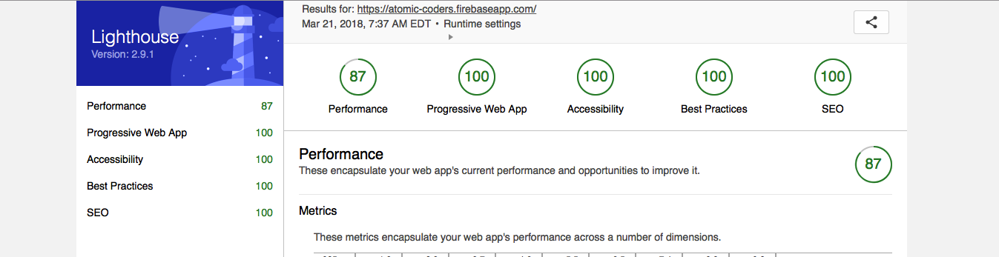

# AC
> *_ReactJS_* progressive web app(__PWA__) shielded with __typescript__

# Demo url:
> https://atomic-coders.firebaseapp.com

# Backend functions

> Firebase functions nodejs implementation.

## Local development setup

- Get custom functions configuration variables
    `firebase functions:config:get > .runtimeconfig.json`

- Start cloud Functions shell
    `firebase experimental:functions:shell`

- Invoke HTTPS functions
    `yourAwesomeFunc()`

# Last PWA audits:

